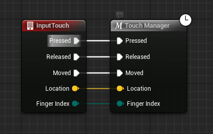

# 🎮 TouchInputSystem

[](#)
[](#)
[-brightgreen)](#)
[](LICENSE)

**TouchInputSystem** is a next‑generation touch input plugin for **Unreal Engine 5** that delivers **AAA-quality controls** on par with **PUBG Mobile** and **Call of Duty: Mobile**.  
It integrates **directly** with Unreal's **Enhanced Input System** (Input Actions + Mapping Contexts), and ships with polished UI widgets like a **virtual joystick** and a **touchpad** out of the box.

> Built for performance, extensibility and creator ergonomics — ideal for shooters, action, racing, RTS, and casual titles targeting iOS/Android or any touchscreen platform.

---

## ✨ Highlights

- 🎯 **AAA Mobile Quality** – latency‑aware design, stable gesture filtering, and responsive feel.
- ⚡ **First‑class Enhanced Input** – no boilerplate. Works with `UInputAction`, `UEnhancedInputComponent`, and `UInputMappingContext`.
- 🧩 **Ready‑made Widgets** – `UTouchJoystick` and `UTouchPad` built on a powerful `UBaseTouchButton` foundation.
- 🧠 **Clean Data Layer** – simple, Blueprint‑exposed data types for all touch states.
- 🛠 **Blueprint & C++ Friendly** – bind in Blueprints *or* use low‑level C++ delegates.
- 🚀 **Optimized** – minimal allocations, pooled state, safe singleton delegates, and editor‑friendly tuning.
- 🧪 **Tested Patterns** – supports toggle buttons, passthrough touches, ticked gestures, and multi‑touch routing.

---

## 📦 Installation

1. Copy the `TouchInputSystem/` plugin folder into your project’s `Plugins/` directory:
   ```bash
   YourGame/Plugins/TouchInputSystem/
   ```
2. Launch your project and enable **TouchInputSystem** under **Edit → Plugins**.
3. Ensure **Enhanced Input** is enabled in your project (UE5 default).
4. Add Below snippet in Player Character or Player Controller
[](https://blueprintue.com/render/bew7nfhf/)


<details>
<summary>Blueprint Snippet Here (Copy and Paste in Editor) </summary>
   
   ```
Begin Object Class=/Script/BlueprintGraph.K2Node_InputTouch Name="K2Node_InputTouch_0" ExportPath="/Script/BlueprintGraph.K2Node_InputTouch'/Game/Blueprints/Pawn/BP_BasePawn.BP_BasePawn:EventGraph.K2Node_InputTouch_0'"
   NodePosX=256
   NodePosY=-384
   NodeGuid=E9E762CF4B5A69DFB4E16F8B54C341A8
   CustomProperties Pin (PinId=71747E5C46A5053287FBAB8156E04742,PinName="Pressed",Direction="EGPD_Output",PinType.PinCategory="exec",PinType.PinSubCategory="",PinType.PinSubCategoryObject=None,PinType.PinSubCategoryMemberReference=(),PinType.PinValueType=(),PinType.ContainerType=None,PinType.bIsReference=False,PinType.bIsConst=False,PinType.bIsWeakPointer=False,PinType.bIsUObjectWrapper=False,PinType.bSerializeAsSinglePrecisionFloat=False,LinkedTo=(K2Node_MacroInstance_1 E4FF9FC341533D603645888EF1D60F0E,),PersistentGuid=00000000000000000000000000000000,bHidden=False,bNotConnectable=False,bDefaultValueIsReadOnly=False,bDefaultValueIsIgnored=False,bAdvancedView=False,bOrphanedPin=False,)
   CustomProperties Pin (PinId=D384F7C14BA527354AAE6293A732E556,PinName="Released",Direction="EGPD_Output",PinType.PinCategory="exec",PinType.PinSubCategory="",PinType.PinSubCategoryObject=None,PinType.PinSubCategoryMemberReference=(),PinType.PinValueType=(),PinType.ContainerType=None,PinType.bIsReference=False,PinType.bIsConst=False,PinType.bIsWeakPointer=False,PinType.bIsUObjectWrapper=False,PinType.bSerializeAsSinglePrecisionFloat=False,LinkedTo=(K2Node_MacroInstance_1 1F9BD817439970D5A565E4946D3E6936,),PersistentGuid=00000000000000000000000000000000,bHidden=False,bNotConnectable=False,bDefaultValueIsReadOnly=False,bDefaultValueIsIgnored=False,bAdvancedView=False,bOrphanedPin=False,)
   CustomProperties Pin (PinId=186B088C45F42F513D5DBAAE614A8D08,PinName="Moved",Direction="EGPD_Output",PinType.PinCategory="exec",PinType.PinSubCategory="",PinType.PinSubCategoryObject=None,PinType.PinSubCategoryMemberReference=(),PinType.PinValueType=(),PinType.ContainerType=None,PinType.bIsReference=False,PinType.bIsConst=False,PinType.bIsWeakPointer=False,PinType.bIsUObjectWrapper=False,PinType.bSerializeAsSinglePrecisionFloat=False,LinkedTo=(K2Node_MacroInstance_1 03130AA3464113E63F0AD789E24D9FD4,),PersistentGuid=00000000000000000000000000000000,bHidden=False,bNotConnectable=False,bDefaultValueIsReadOnly=False,bDefaultValueIsIgnored=False,bAdvancedView=False,bOrphanedPin=False,)
   CustomProperties Pin (PinId=B928E6764BB90A27B411A8825EFB863F,PinName="Location",Direction="EGPD_Output",PinType.PinCategory="struct",PinType.PinSubCategory="",PinType.PinSubCategoryObject="/Script/CoreUObject.ScriptStruct'/Script/CoreUObject.Vector'",PinType.PinSubCategoryMemberReference=(),PinType.PinValueType=(),PinType.ContainerType=None,PinType.bIsReference=False,PinType.bIsConst=False,PinType.bIsWeakPointer=False,PinType.bIsUObjectWrapper=False,PinType.bSerializeAsSinglePrecisionFloat=False,LinkedTo=(K2Node_MacroInstance_1 AEACB43B40F0E3FD69CCE391CAB09FA6,),PersistentGuid=00000000000000000000000000000000,bHidden=False,bNotConnectable=False,bDefaultValueIsReadOnly=False,bDefaultValueIsIgnored=False,bAdvancedView=False,bOrphanedPin=False,)
   CustomProperties Pin (PinId=6C193C104799BCCD7B82B6BCEAAA0D95,PinName="FingerIndex",Direction="EGPD_Output",PinType.PinCategory="byte",PinType.PinSubCategory="",PinType.PinSubCategoryObject="/Script/CoreUObject.Enum'/Script/InputCore.ETouchIndex'",PinType.PinSubCategoryMemberReference=(),PinType.PinValueType=(),PinType.ContainerType=None,PinType.bIsReference=False,PinType.bIsConst=False,PinType.bIsWeakPointer=False,PinType.bIsUObjectWrapper=False,PinType.bSerializeAsSinglePrecisionFloat=False,LinkedTo=(K2Node_MacroInstance_1 0DB0546945E2A07E0453A7870CCB4BFE,),PersistentGuid=00000000000000000000000000000000,bHidden=False,bNotConnectable=False,bDefaultValueIsReadOnly=False,bDefaultValueIsIgnored=False,bAdvancedView=False,bOrphanedPin=False,)
End Object
Begin Object Class=/Script/BlueprintGraph.K2Node_MacroInstance Name="K2Node_MacroInstance_1" ExportPath="/Script/BlueprintGraph.K2Node_MacroInstance'/Game/Blueprints/Pawn/BP_BasePawn.BP_BasePawn:EventGraph.K2Node_MacroInstance_1'"
   MacroGraphReference=(MacroGraph="/Script/Engine.EdGraph'/TouchInputSystem/Macros/TouchMacros.TouchMacros:TouchManager'",GraphBlueprint="/Script/Engine.Blueprint'/TouchInputSystem/Macros/TouchMacros.TouchMacros'",GraphGuid=6BC9C77246E079C4C3C47888685F151D)
   NodePosX=432
   NodePosY=-384
   NodeGuid=52A01E004D61CFECD0C9CB8FF3F95720
   CustomProperties Pin (PinId=E4FF9FC341533D603645888EF1D60F0E,PinName="Pressed",PinType.PinCategory="exec",PinType.PinSubCategory="",PinType.PinSubCategoryObject=None,PinType.PinSubCategoryMemberReference=(),PinType.PinValueType=(),PinType.ContainerType=None,PinType.bIsReference=False,PinType.bIsConst=False,PinType.bIsWeakPointer=False,PinType.bIsUObjectWrapper=False,PinType.bSerializeAsSinglePrecisionFloat=False,LinkedTo=(K2Node_InputTouch_0 71747E5C46A5053287FBAB8156E04742,),PersistentGuid=00000000000000000000000000000000,bHidden=False,bNotConnectable=False,bDefaultValueIsReadOnly=False,bDefaultValueIsIgnored=False,bAdvancedView=False,bOrphanedPin=False,)
   CustomProperties Pin (PinId=1F9BD817439970D5A565E4946D3E6936,PinName="Released",PinType.PinCategory="exec",PinType.PinSubCategory="",PinType.PinSubCategoryObject=None,PinType.PinSubCategoryMemberReference=(),PinType.PinValueType=(),PinType.ContainerType=None,PinType.bIsReference=False,PinType.bIsConst=False,PinType.bIsWeakPointer=False,PinType.bIsUObjectWrapper=False,PinType.bSerializeAsSinglePrecisionFloat=False,LinkedTo=(K2Node_InputTouch_0 D384F7C14BA527354AAE6293A732E556,),PersistentGuid=00000000000000000000000000000000,bHidden=False,bNotConnectable=False,bDefaultValueIsReadOnly=False,bDefaultValueIsIgnored=False,bAdvancedView=False,bOrphanedPin=False,)
   CustomProperties Pin (PinId=03130AA3464113E63F0AD789E24D9FD4,PinName="Moved",PinType.PinCategory="exec",PinType.PinSubCategory="",PinType.PinSubCategoryObject=None,PinType.PinSubCategoryMemberReference=(),PinType.PinValueType=(),PinType.ContainerType=None,PinType.bIsReference=False,PinType.bIsConst=False,PinType.bIsWeakPointer=False,PinType.bIsUObjectWrapper=False,PinType.bSerializeAsSinglePrecisionFloat=False,LinkedTo=(K2Node_InputTouch_0 186B088C45F42F513D5DBAAE614A8D08,),PersistentGuid=00000000000000000000000000000000,bHidden=False,bNotConnectable=False,bDefaultValueIsReadOnly=False,bDefaultValueIsIgnored=False,bAdvancedView=False,bOrphanedPin=False,)
   CustomProperties Pin (PinId=AEACB43B40F0E3FD69CCE391CAB09FA6,PinName="Location",PinType.PinCategory="struct",PinType.PinSubCategory="",PinType.PinSubCategoryObject="/Script/CoreUObject.ScriptStruct'/Script/CoreUObject.Vector'",PinType.PinSubCategoryMemberReference=(),PinType.PinValueType=(),PinType.ContainerType=None,PinType.bIsReference=False,PinType.bIsConst=False,PinType.bIsWeakPointer=False,PinType.bIsUObjectWrapper=False,PinType.bSerializeAsSinglePrecisionFloat=False,LinkedTo=(K2Node_InputTouch_0 B928E6764BB90A27B411A8825EFB863F,),PersistentGuid=00000000000000000000000000000000,bHidden=False,bNotConnectable=False,bDefaultValueIsReadOnly=False,bDefaultValueIsIgnored=False,bAdvancedView=False,bOrphanedPin=False,)
   CustomProperties Pin (PinId=0DB0546945E2A07E0453A7870CCB4BFE,PinName="FingerIndex",PinType.PinCategory="byte",PinType.PinSubCategory="",PinType.PinSubCategoryObject="/Script/CoreUObject.Enum'/Script/InputCore.ETouchIndex'",PinType.PinSubCategoryMemberReference=(),PinType.PinValueType=(),PinType.ContainerType=None,PinType.bIsReference=False,PinType.bIsConst=False,PinType.bIsWeakPointer=False,PinType.bIsUObjectWrapper=False,PinType.bSerializeAsSinglePrecisionFloat=False,DefaultValue="Touch1",AutogeneratedDefaultValue="Touch1",LinkedTo=(K2Node_InputTouch_0 6C193C104799BCCD7B82B6BCEAAA0D95,),PersistentGuid=00000000000000000000000000000000,bHidden=False,bNotConnectable=False,bDefaultValueIsReadOnly=False,bDefaultValueIsIgnored=False,bAdvancedView=False,bOrphanedPin=False,)
End Object
```
</details>

---

## 🧭 Folder Structure

```
TouchInputSystem/
├─ TouchInputSystem.Build.cs
├─ TouchInputSystem.h / .cpp                  # Module setup
├─ Common/
│  ├─ Data/EnumsStruct/
│  │  ├─ ETouchMode.h                         # enum class EEnum_TouchMode
│  │  ├─ FInGameButtonData.h                  # configurable button behavior
│  │  └─ FTouchInputInfo.h                    # per‑touch payload
│  ├─ Delegates/
│  │  ├─ UTouchSystemDelegates.h/.cpp         # global multicast (singleton) delegates
│  └─ Library/
│     ├─ TouchInputFunctions.h/.cpp           # Blueprint function library (broadcast helpers)
└─ Widget/
   ├─ BaseTouchButton.h/.cpp                  # reusable base widget
   ├─ Joystick/TouchJoystick.h/.cpp           # virtual joystick
   └─ TouchPad/TouchPad.h/.cpp                # swipe/look touchpad
```

---

## 🧩 Core Types & API

### `EEnum_TouchMode`
Located in `Common/Data/EnumsStruct/ETouchMode.h`

```cpp
UENUM(BlueprintType)
enum class EEnum_TouchMode : uint8
{
    None,
    Pressed,
    Released,
    Moved,
    Tap,
    Hold,
    HoldReleased
};
```


## 🧱 Widget Layer

### `UBaseTouchButton`
Reusable `UUserWidget` base that handles touch lifecycle + Enhanced Input plumbing.  
Exposes Blueprint‑native events to override:

```cpp
UFUNCTION(BlueprintNativeEvent, Category="BaseInGameButton")
void EventOnPressed(const FVector& FingerLocation);

UFUNCTION(BlueprintNativeEvent, Category="BaseInGameButton")
void EventOnReleased(const FVector& FingerLocation);

UFUNCTION(BlueprintNativeEvent, Category="BaseInGameButton")
void EventOnMoved(const FVector& FingerLocation);

UFUNCTION(BlueprintNativeEvent, Category="BaseInGameButton")
void EventOnEventReceived(const FVector& FingerLocation, EEnum_TouchMode TouchMode);
```

Also provides multicast delegates you can subscribe to from C++ (e.g. `OnPressed`, `OnReleased`, `OnMoved`, `OnEventReceived`). Internally integrates with **Enhanced Input** (`EnhancedInputSubsystems`, `UEnhancedInputComponent`) and routes screen touches to the active widget, including **passthrough** support when desired.

> The base handles per‑frame ticking for gestures when `FInGameButtonData.bTickTouchEvent` is enabled.

### `UTouchJoystick`
A virtual joystick built on `UBaseTouchButton`. Key behavior:

- Computes normalized **direction** and **scale** from touch displacement.
- Gives option to Use a Dedicated Input Action for Sprint, Also Supports Sprint Locking.
- Drives an optional **thumb** image/pad with easing (**`UpdateThumbPad`**, **`RevertThumbPad`**).
- Blueprint‑native event:
  ```cpp
  UFUNCTION(BlueprintNativeEvent)
  void JoystickOutput(const FVector& Direction, const float Scale);
  ```
- Helper:
  ```cpp
  UFUNCTION(BlueprintCallable, BlueprintPure, Category="Joystick")
  FVector2D GetCenterPosition();
  ```

### `UTouchPad`
A look/swipe pad built on `UBaseTouchButton`:

```cpp
UFUNCTION(BlueprintCallable, Category="TouchPad")
void BroadcastControlRotation(const FVector2D ControlRotation);
```

Use it to emit **camera control** deltas or UI‑routed rotation vectors.


## 🧰 Examples You Can Build

- **Shooter** – Left joystick for movement, right touchpad for camera; tap buttons for fire/ADS; hold for continuous fire (ticked input action).
- **Racing** – Joystick for steering + throttle scale; edge taps for brakes; swipe for nitro.
- **RTS/MOBA** – Touchpad to pan camera; tap/hold to select/place; two‑finger swipe to multi‑select.

---

## 🧪 Performance & Quality Notes

- Uses GC‑safe singleton for global delegates (`AddToRoot`/`RemoveFromRoot`).
- Touch math uses Slate’s local/screen conversions for accuracy.
- Thumb visuals are updated with easing and clamped radii to avoid jitter.
- Designed to remain responsive on low‑end Android devices.

---

## 🗺️ Roadmap

- Gesture recorder/replayer for automated testing
- Built‑in visualizers (debug overlay for touch traces)
- More widgets: dual‑zone pad, radial menu, quick‑slots
- Haptics helpers (mobile vibration patterns)

---

## 🤝 Contributing

Issues and PRs are welcome!  
Please include a clear description, reproduction steps (if applicable), and screenshots/GIFs for UI changes.

If this plugin helps you, please ⭐ **star this repository**.
